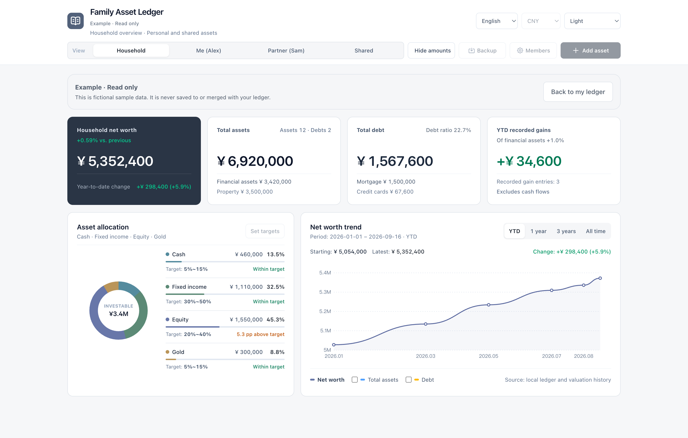
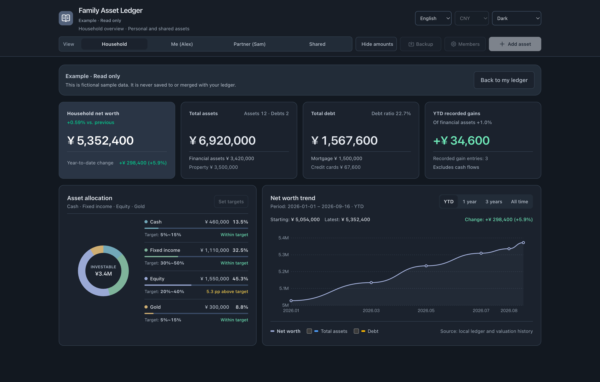

<p align="center">
  
</p>
<h1 align="center">Family Asset Ledger</h1>
<p align="center">A clear view of what your household owns and owes.</p>
<p align="center"><strong>Works offline · Stored in your browser · English & 中文</strong></p>
<p align="center"><strong>English</strong> | <a href="README.zh-CN.md">简体中文</a></p>
<p align="center"><a href="https://zhouhegu.github.io/family-asset-ledger/">Try it online</a> · <a href="https://github.com/zhouhegu/family-asset-ledger/archive/refs/heads/main.zip">Download</a> · <a href="https://github.com/zhouhegu/family-asset-ledger/issues">Feedback</a></p>

Track assets, debts, allocation and net worth in a lightweight browser app. No sign-up, no backend to set up, and no ledger data uploaded. Try it online or download it for offline use.

[](docs/images/dashboard-en-light.png)

*Fictional data in the built-in, read-only example. Your own ledger starts empty. Click an image for the full-resolution version.*

<details>
<summary>See the dark appearance</summary>

[](docs/images/dashboard-en-dark.png)

</details>

## What you can do

- **See the whole household.** Switch between household, personal, partner and shared views; customize member names.
- **Keep balances together.** Record cash, fixed income, equity, gold, property and debt in one place.
- **Follow changes over time.** View net worth history, recent balance changes and investment gains you explicitly record.
- **Review your allocation.** Compare financial asset categories with target ranges you choose.
- **Make it yours.** Switch languages, select one currency for the ledger, and use light, dark or system appearance.
- **Keep a portable copy.** Export JSON backups and restore them in another browser. Hide amounts when sharing your screen.

Balances are entered manually. Update each affected account independently; totals and charts summarize the values you record.

## Get started

**Online:** [Open Family Asset Ledger](https://zhouhegu.github.io/family-asset-ledger/) and choose **View example** to explore with fictional data, or **Add asset** to start your own ledger. No installation is needed.

**Offline:**

1. [Download](https://github.com/zhouhegu/family-asset-ledger/archive/refs/heads/main.zip) and unzip the repository.
2. Open **`index.html`** in a modern browser. Keep the **`assets/`** folder beside it.
3. Choose your currency, then select **Add asset** to record an asset or debt. Use **Import backup** if you already have a ledger.

Want to explore first? **View example** opens a read-only preview with fictional records. **Back to my ledger** returns to your own data; the example never saves or merges its records into your ledger.

No npm installation or build step is needed to use the app. Keep the project in a fixed location and use the same browser and address each time.

The online and downloaded versions have separate browser storage. Use a JSON backup to move your ledger between them. For offline access, use the downloaded version.

## Language, currency and appearance

All three controls are in the top-right corner.

| Setting | Behavior |
| --- | --- |
| Language | English and Simplified Chinese. The first visit follows the browser language: Chinese locales use Chinese; other locales use English. |
| Currency | One currency for all balances and history. Defaults to CNY; USD, EUR, GBP, JPY and others are available. Changing it changes the label, **not the amounts**. Enter balances in the selected currency. |
| Appearance | Light, dark or system. System is the default; a manual selection is remembered. |

Currency is included in backups. Language and appearance preferences stay in the current browser. Member names are managed separately under **Members**.

## Your data and backups

The app stores your ledger in this browser's **`localStorage`**. It does not upload ledger data. Closing the page or restarting the browser normally keeps your records.

**A different browser, browser profile or address has separate storage.** There is no cloud sync. Changing domains, ports or file locations may show an empty ledger; importing a backup creates an independent copy.

To move or back up your ledger:

1. Open **Backup → Export JSON backup** and keep the downloaded file.
2. Open the app in the destination browser or location.
3. Choose **Import backup**, or **Backup → Restore from backup**, and verify the result.

Restoring replaces the current ledger after confirmation. Clearing browser site data can erase local records, so keep a separate backup. Private browsing may discard records when the session ends.

Browser storage and exported JSON files are **unencrypted**. Amount masking only changes what appears on screen.

Application updates preserve existing ledger data. If saved data cannot be read, the app keeps the original storage and blocks ordinary edits until a valid backup is restored.

## Development

The app uses HTML, CSS and JavaScript, with local assets and no runtime package installation.

| Path | Purpose |
| --- | --- |
| `index.html` | Interface and ledger logic |
| `assets/` | Logo, translations, appearance handling and generated CSS |
| `styles/tailwind.css` | Tailwind build entry |
| `tests/ledger.test.cjs` | Data and localization tests |
| [`docs/DATA_FORMAT.md`](docs/DATA_FORMAT.md) | Storage format and backup compatibility |

Run the tests with Node.js 18 or newer; no dependencies are required:

```sh
npm test
```

After changing utility classes, use Node.js 20 or newer to rebuild the stylesheet:

```sh
npm ci
npm run build:css
```

Commit the generated `assets/tailwind.css` with the change. Tailwind scans `index.html`; use complete class names. Add English UI messages in `assets/i18n.js` and keep user-entered text independent of the selected language.

The tests use a simulated DOM and in-memory storage. Check interface changes in a browser with fictional data, including both languages and appearances.

## Contributing

Bug reports, translation improvements and focused pull requests are welcome. For a UI issue, include the browser, language, appearance and steps to reproduce it. Use fictional records in examples and screenshots; keep personal ledgers and backup files out of issues and commits.

If this project is useful to you, consider giving it a star so others can discover it.

## License

[MIT](LICENSE). See [third-party notices](THIRD_PARTY_NOTICES.md) for Tailwind CSS and Lucide attribution.
