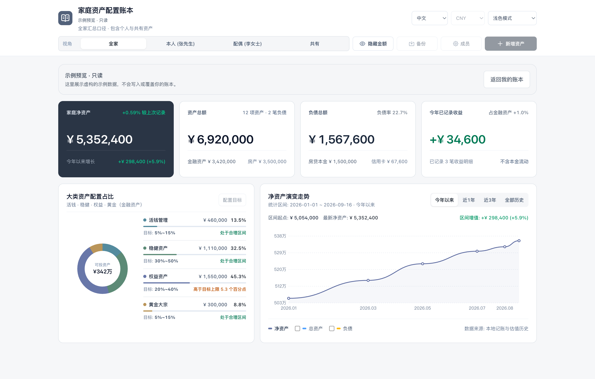
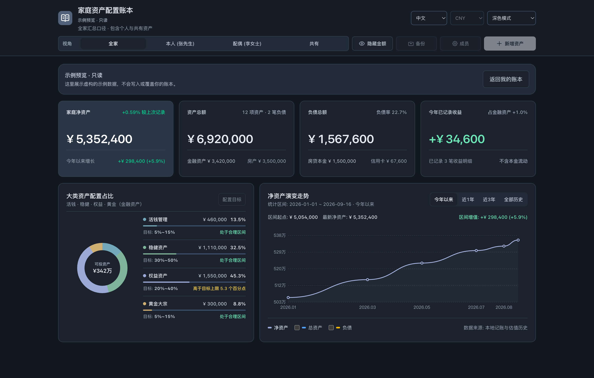

<p align="center">
  
</p>
<h1 align="center">家庭资产账本</h1>
<p align="center">把一家人的资产与负债，记在一本账里。</p>
<p align="center"><strong>离线可用 · 数据保存在浏览器 · 中英文切换</strong></p>
<p align="center"><a href="README.md">English</a> | <strong>简体中文</strong></p>
<p align="center"><a href="https://zhouhegu.github.io/family-asset-ledger/">在线体验</a> · <a href="https://github.com/zhouhegu/family-asset-ledger/archive/refs/heads/main.zip">下载使用</a> · <a href="https://github.com/zhouhegu/family-asset-ledger/issues">反馈问题</a></p>

一个轻量的浏览器账本，用于记录家庭资产、负债、配置占比和净资产变化。无需注册、无需部署后端，账本数据留在自己的浏览器。可以直接在线体验，也可以下载后离线使用。

[](docs/images/dashboard-zh-light.png)

*截图来自内置的只读示例，所有数据均为虚构。你自己的账本从空白开始。点击图片可查看高清原图。*

<details>
<summary>查看深色外观</summary>

[](docs/images/dashboard-zh-dark.png)

</details>

## 可以做什么

- **看清全家资产。** 在全家、本人、配偶与共有视角之间切换，自定义成员姓名。
- **把余额集中记录。** 支持活钱、稳健、权益、黄金、房产和负债分类。
- **查看资产变化。** 展示净资产历史、近期余额变动，以及你明确记录的投资收益。
- **了解配置占比。** 将金融资产分类占比与自己设置的目标区间对照。
- **按习惯使用。** 切换中英文、设置账本统一币种，选择浅色、深色或跟随系统。
- **随时带走数据。** 导出 JSON 备份，在其他浏览器中恢复；展示页面时可隐藏金额。

金额由你手动录入。各账户发生变化时，分别更新其实际余额；汇总和图表根据记录的金额计算。

## 快速开始

**在线使用：**[打开家庭资产账本](https://zhouhegu.github.io/family-asset-ledger/)，点击**查看示例**体验虚构数据，或点击**新增资产**开始自己的账本，无需安装。

**离线使用：**

1. [下载](https://github.com/zhouhegu/family-asset-ledger/archive/refs/heads/main.zip)并解压整个仓库。
2. 使用现代浏览器打开 **`index.html`**，保留同目录下的 **`assets/`** 文件夹。
3. 选择账本币种，点击**新增资产**录入第一项资产或负债。已有账本可直接**导入备份**。

想先了解界面，可以点击**查看示例**。它使用虚构记录，只供查看；点击**返回我的账本**即可返回，示例内容不会写入或混入自己的账本。

使用应用无需安装 npm 依赖或运行构建。建议把项目放在固定位置，并始终使用同一浏览器和入口打开。

在线版与下载版使用各自独立的浏览器存储，迁移账本请使用 JSON 备份。需要断网使用时，请选择下载版。

## 语言、币种与外观

三项设置均在页面右上角。

| 设置 | 行为 |
| --- | --- |
| 语言 | 支持 English 与简体中文。首次访问按浏览器语言选择：中文环境使用中文，其他环境使用英文。 |
| 币种 | 所有余额与历史共用一个币种。默认 CNY，支持 USD、EUR、GBP、JPY 等。更改设置**只改变币种标识，不换算金额**；录入时请统一使用选定币种。 |
| 外观 | 支持浅色、深色和跟随系统。默认跟随系统，手动选择后会记住偏好。 |

币种包含在账本备份中，语言和外观偏好保存在当前浏览器。成员姓名通过独立的**成员**入口修改。

## 数据与备份

账本保存在当前浏览器的 **`localStorage`** 中，应用不会上传账本数据。正常关闭页面或重启浏览器会保留记录。

**不同浏览器、浏览器用户配置和访问地址各有独立的存储空间。** 应用没有云同步。更换域名、端口或文件位置后可能看到空账本；导入备份后得到的是独立副本。

备份或迁移账本：

1. 从**备份 → 导出 JSON 备份文件**保存一份备份。
2. 在目标浏览器或新位置打开应用。
3. 选择**导入备份**，或**备份 → 从备份文件恢复数据**，恢复后核对内容。

恢复会在确认后覆盖当前账本。清除浏览器站点数据可能丢失记录，请保留独立备份；无痕或隐私浏览也可能在会话结束时清除数据。

浏览器存储和导出的 JSON 文件均**未加密**，金额隐藏只影响页面显示。

更新应用会保留已有账本。读取失败时，应用保留原始存储并阻止普通编辑，直到恢复有效备份。

## 开发

项目使用 HTML、CSS 和 JavaScript，资源全部随仓库提供，运行时无需安装包依赖。

| 路径 | 用途 |
| --- | --- |
| `index.html` | 界面与账本逻辑 |
| `assets/` | 图标、翻译、外观处理与已生成的样式 |
| `styles/tailwind.css` | Tailwind 构建入口 |
| `tests/ledger.test.cjs` | 数据与本地化测试 |
| [`docs/DATA_FORMAT.zh-CN.md`](docs/DATA_FORMAT.zh-CN.md) | 存储格式与备份兼容性 |

运行测试需要 Node.js 18 或更新版本，无需安装依赖：

```sh
npm test
```

修改样式类名后，使用 Node.js 20 或更新版本重新生成样式：

```sh
npm ci
npm run build:css
```

请一并提交生成的 `assets/tailwind.css`。Tailwind 只扫描 `index.html`，样式类名应使用完整字符串。在 `assets/i18n.js` 中补充新增文案的英文翻译，保持用户填写的文本独立于界面语言。

测试使用模拟 DOM 与内存存储。界面修改请用虚构数据在浏览器中检查，覆盖中英文及深浅色外观。

## 参与贡献

欢迎反馈问题、改进翻译或提交范围明确的 Pull Request。反馈界面问题时，请说明浏览器、语言、外观和复现步骤。示例与截图请使用虚构数据，不要将个人账本或备份放入 Issue 或提交记录。

如果这个项目对你有帮助，欢迎点一个 Star，让更多人发现它。

## 许可

本项目使用 [MIT 许可证](LICENSE)。Tailwind CSS 与 Lucide 的许可声明见[第三方许可](THIRD_PARTY_NOTICES.md)。
